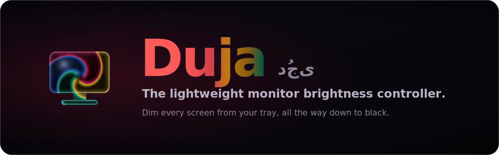
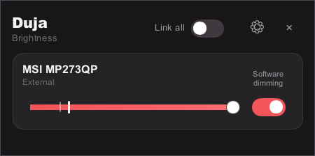
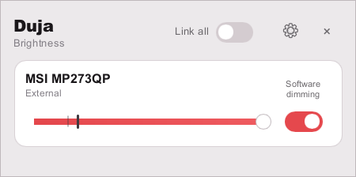
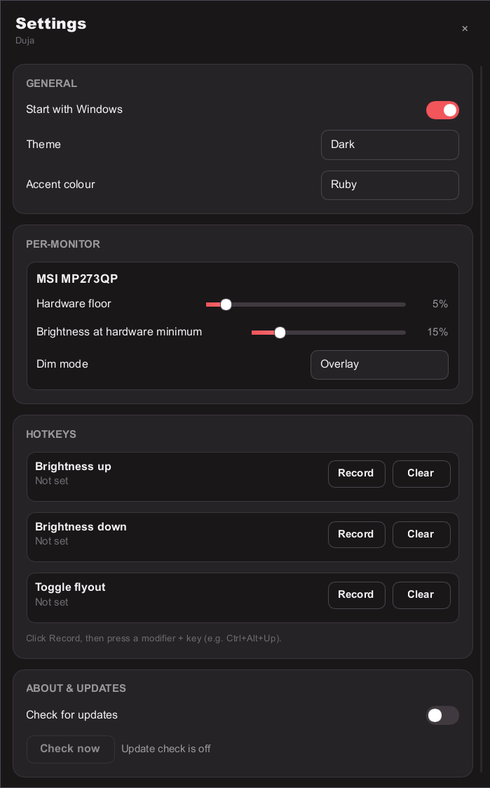

<div align="center">



<br>

[](https://github.com/itabajah/duja/actions/workflows/ci.yml)
[](https://github.com/itabajah/duja/releases/latest)
[](https://github.com/itabajah/duja/releases)
[](#license)
[](#support-matrix)

**Control the brightness of every screen you own from one tray icon. Duja dims real
monitors the way their own buttons do, and keeps going past their darkest setting
all the way to true black. Tiny, native, and instant.**

[**Download**](#install) · [Features](#why-duja) · [Verify a download](#verify-your-download) · [Build from source](#build-from-source) · [Status](docs/STATUS.md)

</div>

---

> **Duja `v0.1.0`: first public release (Windows).** An early build, but a real one: hardware
> control, software dimming, tray + flyout, settings, global hotkeys, input switching, and the
> `dujactl` CLI all work on Windows. macOS backends have landed (Linux is next). Automatic update
> notifications are built in, so you stay on the latest. See [docs/STATUS.md](docs/STATUS.md) for
> the live picture.

## Why Duja

- **Ultra-lightweight.** Rust + [Slint](https://slint.dev) with a software renderer: no webview,
  no bundled browser, no background runtime. Measured budgets: **≤ 35 MB idle RSS** (≈ 24 MB in
  practice), **zero idle CPU wakeups**, a single self-contained `duja.exe`.
- **Hardware control first.** External monitors over DDC/CI (brightness, contrast, input source);
  laptop panels through each OS's native backlight API. Real physical dimming, not a dark overlay.
- **Seamless software floor.** Displays without hardware control (TVs, docks, capture cards), and
  the range *below* hardware 0 %, are dimmed by a click-through overlay, so one continuous slider
  runs from 100 % all the way to true black.
- **Perceptual slider.** The slider position *is* perceived brightness: "20 % looks 20 % bright"
  regardless of the panel's floor. Hardware hands off to the software floor with no visible jump.
- **Multi-monitor native.** Sync groups, per-monitor settings keyed to stable display identity,
  hot-plug that never loses your levels, and live reflection when you turn a monitor's own buttons.
- **Themed & premium.** Light/dark themes, five accent colours, and a resizable settings window,
  all drawn natively.

## Screenshots

<div align="center">

| Flyout (dark) | Flyout (light) |
|:---:|:---:|
|  |  |



<sub>Settings (dark)</sub>

</div>

## Install

**Windows 10/11 (x64).** Grab the latest from the
[**Releases page**](https://github.com/itabajah/duja/releases/latest):

- **Installer (recommended)**: download **`duja-setup-<version>.exe`** and run it. It installs
  per-user (no admin prompt), adds a Start-Menu entry, and offers an optional *"launch at login"*.
- **Portable**: download **`duja-<version>-windows-x64.zip`**, extract it anywhere, and run
  `duja.exe`. No install, no admin.

> [!NOTE]
> **SmartScreen.** The binaries are not yet code-signed, so Windows SmartScreen may show
> *"Windows protected your PC"* on first run. Choose **More info → Run anyway**. You can confirm
> the download is authentic first; see [Verify your download](#verify-your-download).

_Package managers (winget / Scoop) are planned once the release stabilises._

### Updates

Duja checks GitHub for a newer release about once a day (piggybacked on your own interaction, so it
never wakes an idle machine) and, when one is out, adds an **"Update available"** item to the tray
menu and shows a toast. Clicking it opens the releases page; Duja never downloads or installs
anything on its own. Turn it off with `update_check = false` under `[general]` in your config.

## Verify your download

Every release ships a `SHA256SUMS` file and a [minisign](https://jedisct1.github.io/minisign/)
signature (`.minisig`) for each artifact, plus a GitHub build-provenance attestation.

```sh
# 1. checksums (run in the folder with your download + SHA256SUMS)
sha256sum -c SHA256SUMS

# 2. minisign signature (Duja's public key is published in SECURITY.md)
minisign -Vm SHA256SUMS -P <DUJA_MINISIGN_PUBLIC_KEY>
```

The public key and full instructions live in [SECURITY.md](SECURITY.md).

## Support matrix

| Capability | Windows | macOS | Linux |
|---|---|---|---|
| External DDC/CI | ✅ | 🧪 experimental¹ | ⏳ planned (X11/Wayland²) |
| Internal panel | ✅ | 🧪 | ⏳ |
| Overlay dimming | ✅ | 🧪 | ⏳ (not GNOME Wayland³) |
| Tray + flyout | ✅ | ⏳ | ⏳ |
| Hotkeys, input switch, `dujactl` | ✅ | ⏳ | ⏳ |

¹ Apple-Silicon DDC uses private APIs (same approach as MonitorControl / Lunar); the macOS app
shell is still in progress. ² Requires the `i2c-dev` module and a udev rule (`dujactl doctor`
checks). ³ GNOME Wayland exposes no third-party overlay/gamma path; hardware control still works.

## Build from source

```sh
cargo build --workspace          # toolchain pinned in rust-toolchain.toml (1.96.1)
cargo test  --workspace
```

Hardware-touching tests are double-gated and never run in CI:
`DUJA_HW_TESTS=1 cargo test -p duja-ddc -- --ignored` (restores your brightness afterwards).

To reproduce a release build locally:

```sh
cargo build --release -p duja-app -p dujactl
cargo run   --release -p xtask -- dist --version 0.1.0   # → target/dist/ (portable zip)
```

The installer is built in CI with [Inno Setup](packaging/windows/duja.iss); the full pipeline is
[`.github/workflows/release.yml`](.github/workflows/release.yml).

## Contributing

See [CONTRIBUTING.md](CONTRIBUTING.md). Monitor misbehaving? File a
[quirk report](https://github.com/itabajah/duja/issues/new?template=monitor-quirk-report.yml).
Reports seed the shared quirks database that makes Duja work on imperfect hardware.

## License

Dual-licensed under [MIT](LICENSE-MIT) or [Apache-2.0](LICENSE-APACHE), at your option.
UI built with [Slint](https://slint.dev) under its Royalty-Free license.
