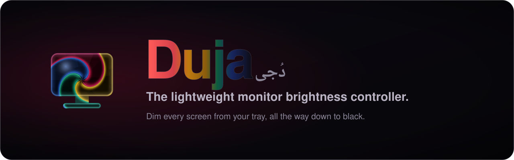
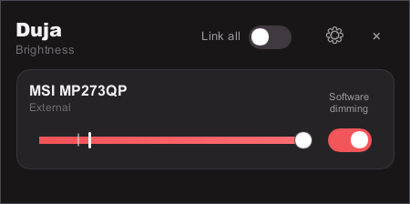
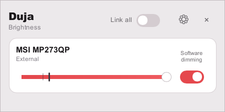
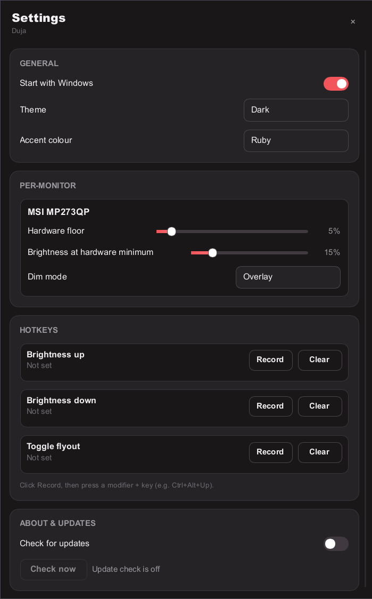

<div align="center">



<br>

[](https://github.com/itabajah/duja/actions/workflows/ci.yml)
[](https://github.com/itabajah/duja/releases/latest)
[](https://github.com/itabajah/duja/releases)
[](#the-fine-print)
[](#get-it)

### Every screen you own. One slider. All the way down to black.

[**Download**](#get-it) · [What it does](#what-it-does) · [Screenshots](#screenshots) · [Build it](#build-it-yourself) · [Status](docs/STATUS.md)

</div>

---

## Your monitor has brightness buttons

They are on the back. There are five of them, none is labelled, and the menu
they open was designed in 2009. You are never going to use them.

Duja is a tray icon. Click it, drag one slider, and every display you own dims
**for real**: over DDC/CI on your externals, over the native backlight on your
laptop panel. The same signal those buttons send, minus the archaeology.

## Hardware zero is not the bottom

Most panels give up somewhere around "still too bright at 2am". Duja keeps
going. Past the hardware floor it takes over in software, so one continuous
slider runs from sunlit desk to true black, and you cannot see the seam where
the handoff happens.

## What it does

- **A slider that tells the truth.** 20 % looks 20 % bright, on any panel,
  whatever its floor. No two monitors disagreeing about what "half" means.
- **Multi-monitor, properly.** Link them all to one slider, or tune each one and
  let Duja remember. Settings are keyed to the display itself, so unplug, dock,
  reboot, and your levels come back exactly where you left them.
- **Weighs nothing.** No Electron, no webview, no bundled browser, no background
  service. About 24 MB of RAM, and zero CPU while it sits there being useful.
- **Nice to look at.** Native light and dark themes, five accent colours, and a
  flyout that opens right at the tray instead of in the middle of your screen.
- **Power tools in the box.** Global hotkeys, HDMI and DisplayPort input
  switching from the tray, and `dujactl` for people who script their desk.
- **Quiet by design.** No telemetry, no account, no ads, no upsell. One optional
  update check a day, and it never installs a thing behind your back.

Free, open source, and written in Rust because your brightness slider should not
need a garbage collector.

## Screenshots

<div align="center">

| Flyout (dark) | Flyout (light) |
|:---:|:---:|
|  |  |



<sub>Settings (dark)</sub>

</div>

## Get it

Everything lives on the [**Releases page**](https://github.com/itabajah/duja/releases/latest).

| | grab this | then |
|---|---|---|
| **Windows 10/11** | `duja-setup-<version>.exe` | Run it. Per user, no admin prompt. Prefer no installer? Take the `.zip` and run `duja.exe` from anywhere. |
| **macOS 11+** | `duja-<version>-macos-universal.dmg` | Drag Duja to Applications. Intel and Apple Silicon in one bundle. |
| **Linux x64** | `duja-<version>-linux-x64.tar.gz` | Extract, put `duja` and `dujactl` on your `PATH`, run `dujactl doctor`. |

<details>
<summary><b>First run may need one extra click (Windows and macOS), and Linux likes a checkup</b></summary>

<br>

**Windows.** The binaries are not code signed yet, so SmartScreen may say
*"Windows protected your PC"*. Choose **More info**, then **Run anyway**. If
you would rather trust maths than a dialog box, verify the download first (see
[the fine print](#the-fine-print)).

**macOS.** The app is signed ad hoc rather than with a Developer ID, so macOS
blocks the first open of a downloaded copy. Allow it under **System Settings →
Privacy & Security → Open Anyway**. macOS 15 removed the old Control-click →
Open trick, so guides that still recommend it are out of date. `dujactl` rides
inside the bundle; symlink it if you want it on your `PATH`:

```sh
sudo ln -s /Applications/Duja.app/Contents/MacOS/dujactl /usr/local/bin/dujactl
```

**Linux.** Run `dujactl doctor` before anything else. Linux sessions vary more
than the other two platforms, and doctor prints exactly what yours can do and
what to install if something is missing. Three things worth knowing up front:
the tray needs a `StatusNotifierItem` host (native on KDE Plasma, an extension
away on GNOME); external monitors need the `i2c-dev` module and permission on
`/dev/i2c-*`, which doctor will talk you through; and global hotkeys are not
available on Linux at all, so Duja greys those rows out and tells you why
instead of pretending.
[`packaging/linux/README.md`](packaging/linux/README.md) has the full story.

</details>

Package managers (winget, Scoop) are planned once the release stabilises.

> [!NOTE]
> **Windows is the road-tested one.** macOS and Linux ship as **unverified
> previews**: the code is complete and green on CI for both, and nobody has yet
> run either build on the hardware it targets. Treat a first run as an
> experiment, and please
> [tell us what happened](https://github.com/itabajah/duja/issues/new?template=monitor-quirk-report.yml).
> [docs/STATUS.md](docs/STATUS.md) keeps the honest scoreboard.

## Scriptable, too

```sh
dujactl list                     # every display, with its id and level
dujactl set all brightness 30    # the whole desk, in one go
dujactl input <id> hdmi1         # switch inputs without touching the monitor
dujactl doctor                   # what your machine can actually do
```

## Build it yourself

```sh
cargo build --workspace
cargo test  --workspace
```

That is the whole ritual. The toolchain is pinned in `rust-toolchain.toml`, and
[CONTRIBUTING.md](CONTRIBUTING.md) covers the rest. Cutting a real release is
[docs/release-checklist.md](docs/release-checklist.md), driven by
[`.github/workflows/release.yml`](.github/workflows/release.yml).

## Under the hood, for the curious

Rust and [Slint](https://slint.dev) with a software renderer, so there is no
browser hiding in your tray. 1,489 tests, 6 fuzzers, three green CI lanes, a
lint wall that bans `unwrap` in shipping code, and an adversarial review of
every single pull request. Every release carries checksums, a
[minisign](https://jedisct1.github.io/minisign/) signature and a GitHub build
provenance attestation.

The architecture decisions are written down in [docs/adr/](docs/adr/), including
the ones that turned out to be wrong.

## The fine print

- **Verify a download**: `SHA256SUMS` plus a `.minisig` for every artifact. The
  public key and the commands are in [SECURITY.md](SECURITY.md).
- **A monitor misbehaving?** Run `dujactl doctor --report` and file a
  [quirk report](https://github.com/itabajah/duja/issues/new?template=monitor-quirk-report.yml).
  Those reports feed the built-in quirks database that makes Duja work on
  imperfect hardware, which is most hardware.
- **License**: [MIT](LICENSE-MIT) or [Apache-2.0](LICENSE-APACHE), your choice.
  UI built with [Slint](https://slint.dev) under its Royalty-Free license.
